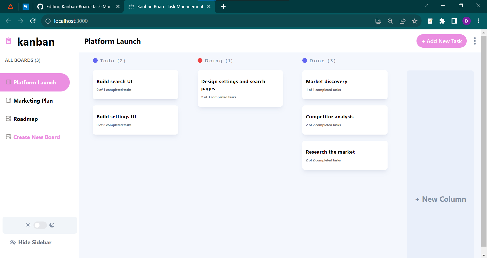

# Kanban Board for Task Management

## Overview

This project is a Kanban board application inspired by platforms like Trello. It allows users to seamlessly manage tasks across different stages of completion. The application provides a user-friendly interface for creating, editing, and deleting tasks, as well as moving them between the To Do, Doing, and Done categories. It also offers a responsive design for mobile devices.



You can access the live demo of the application [here](https://your-live-demo-url.com).

## Features

### 1. Homepage

- The homepage displays all tasks, organized by their status groups: To Do, Doing, and Done.

### 2. Task Card

- Each task is presented in a card format, showcasing the task title and description.

### 3. Add Task

- Users can create new tasks using an integrated form that prompts them for the title and description.

### 4. Edit Task

- An option is provided to edit an existing task's title and description.

### 5. Delete Task

- The application allows users to permanently remove a task.

### 6. Task Status

- Users can effortlessly drag and drop tasks between the To Do, Doing, and Done categories to update their status.

### 7. Responsive Design

- The application is fully functional and visually coherent on mobile devices, ensuring a seamless user experience.

## Installation

To run this application locally, follow these steps:

1. Clone this repository to your local machine:

   ```bash
   git clone https://github.com/your-username/kanban-board.git
   
2. The application will be available at `http://localhost:3000` in your web browser.

## Backend API

The backend API for this project supports CRUD (Create, Read, Update, Delete) operations for tasks. Tasks are stored in a database.

## Built with

- CSS Fraamework
- Drag and Drop API
- React
- Redux
  
